# Docker Lab - Advanced Group

## Overview

This repository documents the completion of all 21 Docker lab tasks for the Advanced Group. All tasks were completed using command-line interface as required.

## Lab Requirements

- All tasks completed via command line
- Report generated in Markdown
- Screenshots included as proof
- Work defended successfully

## Tasks Completed

### Basic Operations (Tasks 1-11) - 50 pts

| # | Task | Command |
|---|------|---------|
| 1 | Show docker version | `docker --version` |
| 2 | Login to Docker Hub | `docker login -u devdaga81` |
| 3 | Find debian images | `docker search debian` |
| 4 | List all images | `docker images` |
| 5 | List all containers | `docker ps -a` |
| 6 | List running containers | `docker ps` |
| 7 | Download Debian: trixie | `docker pull debian:trixie` |
| 8 | Download Debian: latest | `docker pull debian:latest` |
| 9 | List all containers | `docker ps -a` |
| 10 | List running containers | `docker ps` |
| 11 | List all images | `docker images` |

### Container Management (Tasks 12-16) - 10 pts

| # | Task | Command |
|---|------|---------|
| 12 | Launch container by image name | `docker run debian:latest` |
| 13 | Launch cont-no1 by image ID | `docker run --name cont-no1 <image-id>` |
| 14 | Launch cont-no2 in interactive mode | `docker run -it --name cont-no2 <image-id>` |
| 15 | List all containers | `docker ps -a` |
| 16 | List running containers | `docker ps` |

### Custom Image - cowsay + fortune (Tasks 17-21) - 20 pts

| # | Task | Command |
|---|------|---------|
| 17 | Create container with cowsay & fortune | `docker run debian:latest` then install |
| 18 | Prove image was created | `docker images` |
| 19 | Launch image and show cowsay | `docker run devdaga81/my-cow-app` |
| 20 | Create Dockerfile | See Dockerfile below |
| 21 | Prove image was created | `docker images` |

## Dockerfile

```dockerfile
FROM debian:trixie
RUN apt-get update && apt-get install -y cowsay fortune
ENTRYPOINT ["/usr/games/cowsay"]
```

This Dockerfile:
1. Uses `debian:trixie` as base image
2. Installs `cowsay` and `fortune` packages
3. Sets entrypoint to `/usr/games/cowsay`

## Docker Hub Image

The custom image was pushed to Docker Hub:

- **Image:** `devdaga81/my-cow-app`
- **Tag:** `latest`
- **Pull Command:** `docker pull devdaga81/my-cow-app:latest`

## Screenshot Proofs

The following screenshots provide proof of work completed:

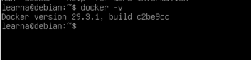
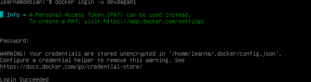
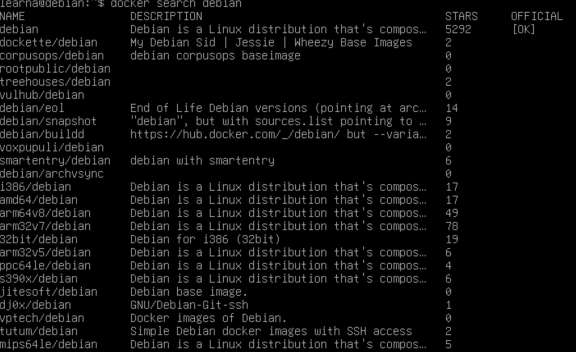
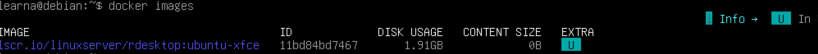
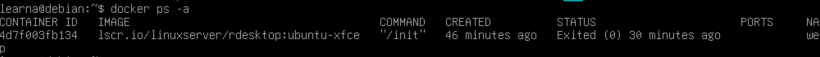
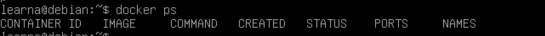
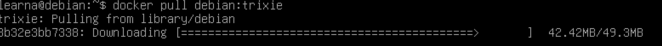
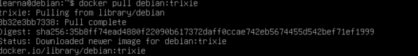
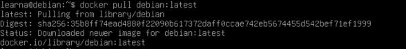
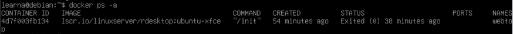
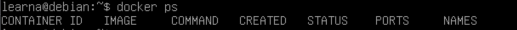
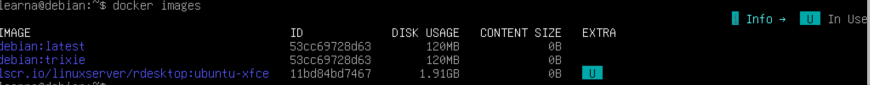
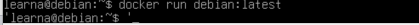
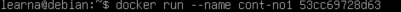
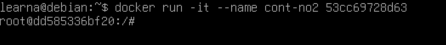
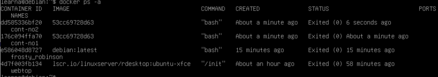
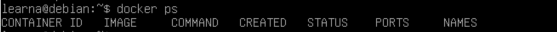
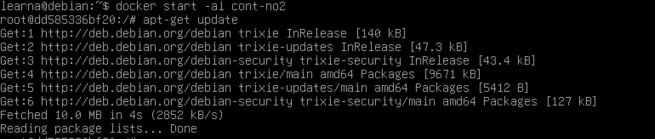
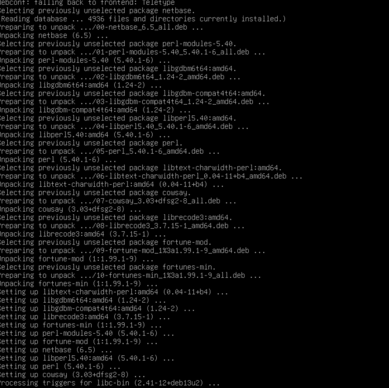
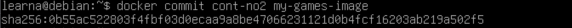
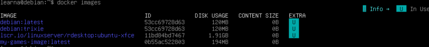
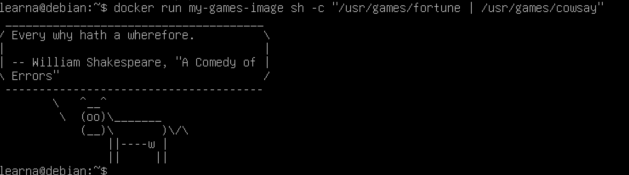
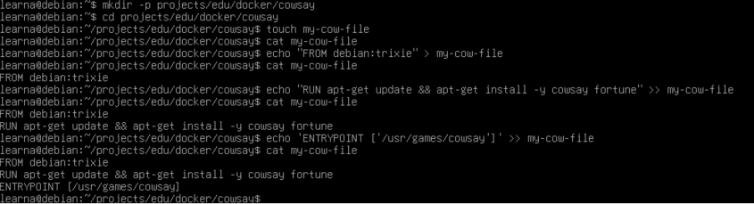
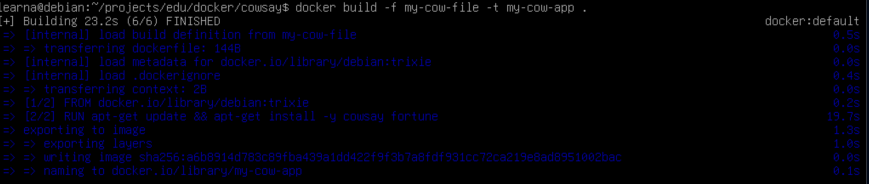
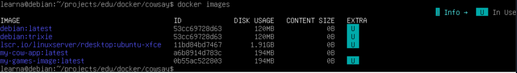

## Scores

| Tasks | Points |
|------|--------|
| 1-11 | 50 |
| 12-16 | 10 |
| 17-19 | 20 |
| 20-21 | 20 |
| **Total** | **100** |

## Author

Student: Adeyemi Kolade
Course: Docker (Advanced Group)
Date: April 2026